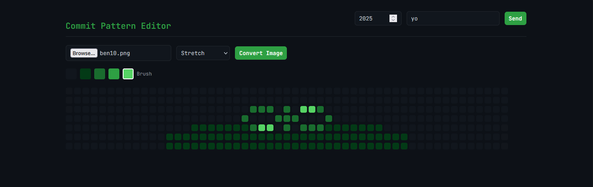

# Commit Canvas

This tool allows you to generate git commits on specific dates. You can draw your commit pattern in a browser interface, then replay those commits into a repository to customize your GitHub contributions graph.

## Screenshots

Add your screenshots of the editor, example patterns, and profile result:

  

## How to Use

1.  Download or clone this project:

        git clone https://github.com/hasan-bro-coder/commit-canvas
        cd commit-canvas

2.  Install dependencies:

        npm install

3.  **Create a new GitHub repository via GitHub UI or CLI**:

4.  Prepare the repo folder: Inside the project, there is a `repo` directory. Go inside and initialize git:

        cd repo
        git init
        cd ..

5.  Start the server:

        node main.js

6.  Open the browser interface: `http://localhost:3000`, draw your pattern, choose the year, and click **Send**.
7.  Wait for all commits to finish (depends on your pattern size).
8.  Push commits to GitHub:

        cd repo
        git remote add origin <your-repo-url>
        git push origin master

    (or `main` depending on your default branch)

9.  ### **to remove the pattern just delete the repository**

## Notes

- The script rewrites commit history by setting the `--date` for each commit.
- Invalid dates in the grid are automatically skipped.
- Higher intensity cells mean multiple commits on that day.

## Possible Simplifications

- Automatically initialize git and set remote inside the `repo` folder.
- Automatically push after all commits finish.
- Allow selecting the repo folder from the browser interface.
- Turn it into a desktop app using Tauri or Electron.
- Add a live preview of your commit graph before committing.
